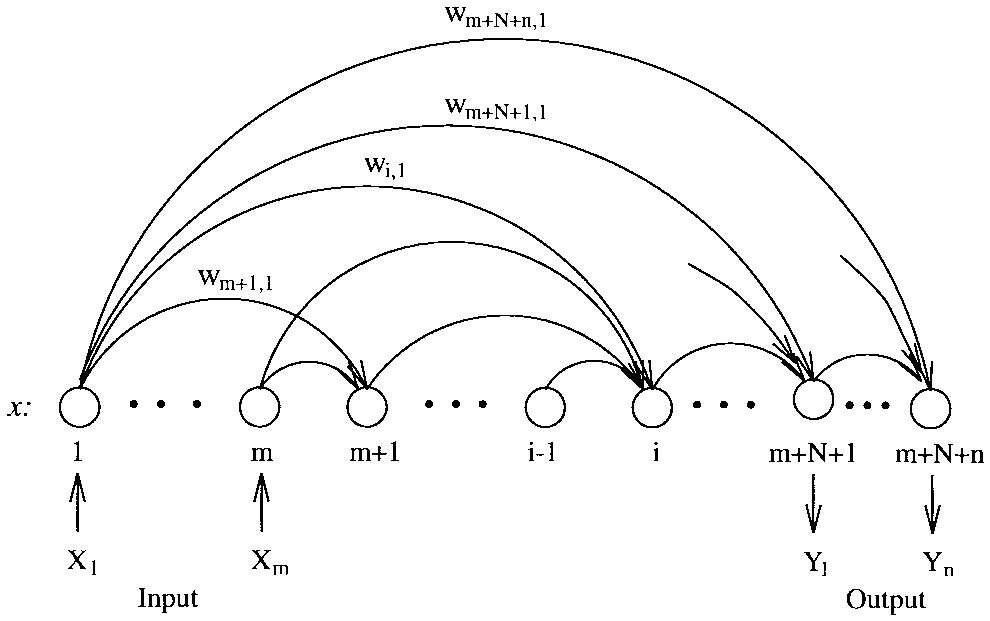
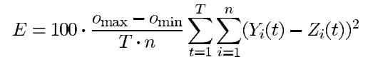

# EPNet如何工作？基于统计的EPNet性能分析及改进思路

 <div align="center">
    叶璨铭, 12011404 <br>
    南方科技大学计算机科学与工程系 <br>
    12011404@mail.sustech.edu.cn <br>
</div>


<!-- SUSTech CS Course of EA with its Application, Assignment 3, First Report, May 2023 -->

## Abstract


\* 本文的Python版本代码已在[GitHub](https://github.com/Two-Cats-Software-Organization/EvolutionaryAssignment3.git)上开源。

## Contents

[TOC]

## Introduction (EPNet 概述)

## EPNet Details Explanation (容易忽略的十大 EPNet 实现细节)

EPNet是一个复杂的系统，拥有11个伪代码步骤。Yao&Liu认为EPNet的本质（essence）是使用了hybrid training, node deletion, connection deletion, connection addition, and node addition这五种mutation的普通Evolutionary Programming (EP)算法。[^1]当然，这五个步骤是EPNet发挥效果的重要操作，值得我们深入学习其优点；不过，EPNet其他步骤并不是普通的EP算法，相反，其中内藏玄机。有些步骤是EPNet的关键选择，对于EPNet发挥作用很有帮助，而有些步骤是EPNet根据当时主流研究者的习惯随意设置的，不一定是最优的。

下面，我们整理出EPNet中值得研究的十大步骤，

- 对于Yao&Liu认为最关键的五个Mutation，我们总结论文的观点，并且给出正确的代码实现。
- 对于EPNet的关键选择，我们阅读EPNet所引用的文献以及其他的文献，对其有效性做出解释，并给出正确的代码实现。
- 对于EPNet理论性不够强的步骤，我们结合20年后最新的论文的观点，提出改进思路。

### 1. ANN的选择和个体表示编码

#### Generalized Multilayer Perceptrons （GMP）



#### 为什么ANN采用 Generalized Multilayer Perceptrons 而不是Fully Connected Network？

根据搜索引擎的搜索结果，如今提到神经网络，研究人员往往第一反应并不是上面提到的 Generalized Multilayer Perceptrons ，而是 Fully Connected Network[^5]。如果将学术研究的发展看做演化计算，看起来FCN的“适应度”（受研究人员的喜爱程度）比GMP更高，以至于在20多年的发展中淘汰了前者。然而，这是一个武断的结论，我们需要学习的是，GMP和FCN各自的优势和劣势，以及他们适合的场景。

2016年，Huang等提出了DenseNet，作为对ResNet的改进，他们的论文获得了CVPR2017 Best Paper[^6]。DenseNet的设计如下图所示，每一个特征图（Feature Map）在被`BN-ReLU-Conv`提取特征前，输入是前面所有已知输出的特征图的自适应组合。这和GMP的设计思路是完全一致的。事实上，Huang等人在论文中考证，早在1991年，Fahlman&Lebiere就提出了类似的结构，由于ANN复兴，相关结构的研究在近年重新得到重视[^7]。


那么这种结构的设计的好处是什么呢？根据ResNet和DenseNet的理论分析和实验结果，Huang等人总结主要有以下几个好处：[^7]

- 缓解梯度消失问题，从而使得深达百层的深度网络成为可能。
- 增强特征传播（feature prpagation）
- 鼓励特征复用
- 降低参数量（控制性能相同的前提下，只需要小参数量版本的DenseNet就能达到ResNet的效果）

可能有人会疑惑，DenseNet的目的是为了更加深层的网络，可是GMP中没有层的概念。事实上，GMP中一个神经元的输出是单个实数，神经元作为一个函数是将前面神经元输出的实数集进行线性组合；而类似于DenseNet的网络中，线性组合的对象是实数向量（特征图），实数向量需要经过多层感知机（MLP）后转换为另一个实数向量。如果把DenseNet的MLP看做GMP中的神经元，那么MLP实际上是GMP中bias的作用。因此，可以认为在GMP中的“隐藏节点数量”就是DenseNet中”层“的数量。这种视角下，我们把GMP认为不是对FCN的改进，而是对一长串神经元的改进。

因此，**EPNet采用GMP的好处可以从两个角度总结**：

- 相比与一长串神经元
  - 避免退化现象。即隐藏节点变多，训练损失收敛速度反而变慢[^8]。
  - 避免梯度爆炸和梯度消失现象
  - 鼓励特征复用
- 相比于单层FCN
  - 每一个隐藏节点之间具有非对称性，避免论文[^1]提到的对称参数优化问题（各个参数可以互换位置，使得表示不compact，搜索空间过大）。

#### 代码实现

了解了本文中采用的 Generalized Multilayer Perceptrons 的计算过程后，我们需要通过编程在内存中实际存储、运算一些状态变量，才能实现ANN个体的抽象数据结构（ADT）。如果我们实现的ANN不能提供一定的灵活性，我们后续演化算法的实现中就无法。结合论文后面用到的操作，我们的ADT需要至少支持以下的attribute或者method:

- 构造方法。
  - 需要指定输入神经元的数量、输出神经元的数量、最多隐藏神经元数量。
  - 需要有属性**神经网络结构和连接权重**。
- 随机初始化
  - 包括对**神经网络结构的初始化**和对**权重的初始化**。我们将在下一个section描述。
- 支持**前向传播与反向传播**。
- 支持对权重的修改，以便进行模拟退火。
- 支持对神经元连接存在性、神经元存在性的修改。

我们采用了论文中在 III. EPNet A. Encoding Scheme for Feedforward ANN's 中建议的双矩阵法[^1]。其中一个矩阵表示连接的存在性，另一个表示若存在连接，连接的权重是多少。论文还有一个向量表示神经元的存在性。然而，论文漏掉了一个重要的向量——bias。在每个存在的神经元完成计算后，应当加上一个bias，而论文段落中忘记提到这个参数是ANN编码的重要组成部分[^1]。

Zhang在复现论文[^1]时，也注意到了这一问题，但是其复现代码没有按照原文的公式来复现，而是通过增加了一个输出始终为1的神经元来试图解决这一问题[^3]。Zhang根据WERBOS在1990年的研究成果得知，这么做和增加偏置是等效的[^3]。这很容易理解，毕竟在 GMP 中，每一个后继神经元与前面的所有神经元都有联系，也就包括了和增加的1节点的关系，从而和1节点的连接权重就是偏置。

尽管Zhang的复现有一定的道理，我们的复现还是遵循GMP的原始公式，以便保持两个矩阵一样大。这并不是什么难事，bias是每一个非输入神经元综合信息后输出的偏置，因此对于每一个非输出神经元来说都有一个值。事实上，**bias向量**的维度应该和**神经元的存在性向量**一样长，正如**连接存在性矩阵**和**连接权重矩阵**维度一样大。我们将这种表示方法称为**“双矩阵双向量”**法，其代码实现如下

```python
 def __init__(self, input_dim, output_dim, max_hidden_dim):
        super(Individual, self).__init__()
        # 1. 形状计算
        self.input_dim = input_dim
        self.output_dim = output_dim
        self.max_hidden_dim = max_hidden_dim
        self.num_nodes = input_dim+output_dim+max_hidden_dim
        self.num_middle_result_nodes = output_dim+max_hidden_dim
        # 2. 不求导的参数。对BP而言他们是常数
        # - i是一种索引方法：从第一个非输入节点（第一个隐藏层节点）开始计算。
        # - j是另一种索引方法：从第一个输入节点开始计算。
        # connectivity[j, i] 表示第i个节点的输入是否来自第j个节点
        self.connectivity = nn.Parameter(torch.zeros(self.num_nodes, self.num_middle_result_nodes,
                                                     dtype=torch.int8), requires_grad=False)
        # node_existence[i] 表示第i个节点是否存在。
        self.node_existence = nn.Parameter(torch.zeros(self.num_middle_result_nodes,
                                                       dtype=torch.int8), requires_grad=False)
        self.node_existence[-self.output_dim:] = 1  # 输出节点必须存在
        # 3. 要求导的参数。对BP而言他们是变量。
        # weight[j, i] 表示第i个节点的输入是第j个节点的输出
        self.weight = nn.Parameter(torch.zeros(
            self.num_nodes, self.num_middle_result_nodes))
        # bias[i] 表示第i个节点的bias
        self.bias = nn.Parameter(torch.zeros(self.num_middle_result_nodes))
        # 激活函数
        self.activation = nn.Sigmoid()
        self.reset_parameters()
```

除了这种表示，ANN还能表示为一个Digraph，使用数据结构中经典的邻接表表示法。这种表示支持动态地添加节点、节点之间的连接，可以进行DFS、BFS等遍历，但是并不适合ANN。

```c++
// 有向图的一般表示
std::vector<Edge> mEdges; // from, to, weight
std::vector<std::forward_list<size_t>> mAdjacencyList;
void addEdge(size_t vertexU, size_t vertexV, size_t weight);
mAdjacencyList[q] // q的邻居节点列表
```

比起那种表示方式，“双矩阵双向量”表示法非常适合构建一个容易求导的、统一的计算图，中间没有if分支，性能较高。以前向传播为例：

```python
def forward(self, x):
        # x: [batch_size, input_dim]
        results = []
        results += list(x.T.to(torch.float32))  # 输入节点的输出就是输入re
        effective_weight = self.connectivity * self.weight
        for i in range(self.num_middle_result_nodes):
            # 1. effective_weight * 前面所有节点的输出
            previous_signals = torch.vstack(results[:self.input_dim+i]).T
            connections_weights = effective_weight[:self.input_dim+i, i]
            res = torch.matmul(previous_signals, connections_weights)
            # 2. 加上bias
            res = res + self.bias[i]
            # 3. 激活
            res = self.activation(res)
            # 4. 乘以node_existence
            res = res * self.node_existence[i]
            # 5. 加到middle_results中
            results.append(res)
        return torch.vstack(results[-self.output_dim:]).T
```

如上，该图可以通过`torch.compile`转换为静态图。根据[^2]数据，这种方式能够带来50%的效率提升，因此大幅提高了我们复现的EPNet的潜在性能。

### 2. ANN个体初始化

在Population-Based优化方法当中，解的初始值是至关重要的。好的随机初始化可以加速演化算法寻找解的速度。[^9]不过，我们这里的个体是神经网络，对于神经网络的权重如何进行初始化也是一门学问。Kumar曾指出，不合适的神经网络权重初始化可能大大降低梯度下降训练的效果。

#### ANN架构初始化

Yao&Liu在论文[^1]中III. EPNET对EPNet架构初始化的描述是“The number of hidden nodes and the initial connection density for each network are uniformly generated at random within certain ranges.” 

这里提到了隐藏节点的数量一定范围（在N-Parity实验中是[2, N]）[^1]服从均匀分布，但是有歧义，可以有两种实现方式:

1. 变量“最大隐藏节点”服从这里说的分布，而具体每个节点是否存在是以0.5的概率随机生成。

2. 最大隐藏节点是这里范围的最大值（比如N），从U[2, N]得到实际存在的节点数量，具体是哪几个节点存在、哪几个不存在，是进一步随机生成的。

然而，该论文其他地方没有再对这里进行详细说明和解释，而且该论文没有开源官方代码。根据Zhang的复现，他的理解是第二种理解。[^3]因此我们也采用这种方法。

这里还提到了 connection density是一个实数(比如N-Parity实验中是0.75)，可以理解为

- 连接存在性矩阵每一个元素服从Bern(connection density)。

#### ANN权重初始化

Yao&Liu在论文[^1]中III. EPNET对EPNet权重初始化的描述是“The random initial weights are uniformly distributed inside a small range.” 除了这句话之外，论文中别的地方没有提到这个重要的问题，而且实验设置中也没有告诉我们具体“small range”是什么样的范围[^1]。根据Zhang对EPNet的复现代码，矩阵每一个元素服从$N(0, 7/6)$，但是Zhang并没有对此进行合理的解释[^3]。

既然EPNet并没有一个明确的思路和理论来解释ANN权重的初始化，**我们有必要学习现代神经网络的权重初始化理论，将其引入到EPNet中**。

如果ANN的权重使用均值为零，方差为$v^2$的高斯分布初始化，$v^2$的最优取值是多少？这是ANN权重初始化研究领域的基本问题。[^11] Glorot and Bengio的理论研究表明，如果激活函数为线性函数(y=x, 也就是不使用激活函数)，**最优初始化是$v^2=\frac{1}{N}$**，其中N是输入到这个神经元的输入数量。这种方法又称为Xavier Initialization。

He等人进一步实验研究发现，Xavier Initialization对于ReLU、Leaky ReLU等激活函数并不好用，于是针对这类激活函数提出He Initialization。而Kumar随后提出一个理论框架证实了He Initialization的有效性。

对于EPNet，我们使用的是Sigmoid激活函数。根据Kumar的理论，**针对Sigmoid激活函数的最优v值符合公式$v^2 = \frac{1}{N\times(g^{'^2}(0)\times (1+g^2(0)))}$，其中g是Sigmoid函数，而N是神经元的输入数量**。对于Sigmoid，$g(0)=0.5, g{'}(0)=0.25$。

对于EPNet的bias，根据Xavier的建议，bias应当初始设置为0。

本文复现EPNet时follow了这一思路。需要注意EPNet中每一个非输入神经元的输入数量都在递增，因此每一个神经元的初始化策略都有所不同。越是后面的神经元，连接权重的方差越小。

### 3. 适应度函数、BP训练损失函数与训练成功性验证函数

在EPNet论文中，目标函数有三重含义——适应度函数、BP训练损失函数与训练成功性验证函数，这三个函数的定义略微有所不同，而且分别用于不同的地方。**我们将这三个函数记作f, l, v**。 

从用途上，

- 适应度函数f (fitness function)是EPNet外层演化计算步骤进行"rank-based selection"的依据。
- BP训练损失函数l (BP training loss function)是使用BP算法进行训练的求导依据。
- 训练成功性验证函数v(training success validation function)

EPNet使用了Prechelt建议的损失函数E



并且使得$f=\frac{1}{E_{val}}$, $l={E_{train}}$, $v=E_{val}$[^1]。不过，具体到N Parity问题时，Yao&Liu使得**train=val, 因为N Parity数据集很小，关注的主要是演化计算是否设计出结构精巧的ANN问题**而不是错误率或泛化性能的问题[^1]。

E实际上是个略微修改的MSE损失函数[^10]，修改的地方在于$o_{max}-o_{min}$，即整个数据集中，所有输入得到的所有输出中的最大和最小。

```python
def prechelt_mse_loss(input: Tensor, target: Tensor):
    # 注意input是y_pred, target是y_true
    return F.mse_loss(input, target)*(input.max()-input.min())*100
```

我们注意到，EPNet实验中遇到的问题**实际上都是分类问题**，而EPNet的输出神经元的激活函数为Sigmoid。如今研究者广泛认为[^13][^14][^15]，针对这样的情况，**Loss函数应当选择Binary Cross Entropy函数**[^12]而不是EPNet选择的MSE损失函数，这是因为BCE损失函数对于这个问题是凸函数更好优化[^13]，而且BCE损失函数的统计假设更为合理[^14]。

当然，使用EPNet采用的E也可以进行优化，于是我们同时实现了两种方法，并且在实验部分进行了对比。

### 4. 种群更新策略 (Replacement Strategy ) 和代际差异 (Generation Gap)

在EPNet中，种群更新策略具体来说是这样的：[^1]

1. 每一轮只选择一个个体作为parent进行变异。
2. BP训练阶段就成功，则parent被替代，直接进入下一轮
3. SA训练阶段就成功，如果改变显著，则parent被替代。
4. 删除阶段才成功，则如果比最差个体好，最差个体被替代。
5. 增加阶段才成功，则最差个体一定被替代，因为增加节点一定有前途。

注意，BP和SA是一步的两个选择，而不是级联的两步，使用BP还是SA取决于上一次训练是否失败。

其中最让人诧异的可能就是EPNet为什么每次只选择一个个体进行变异，而且最后要不修改最好的个体，要不修改最差的个体。这样的不足之处很明显

- 随着种群数量的增大，算法的效果没有显著的变好。
  - 用户本来期望更多的个体可以探索搜索空间的不同部分，
  - 然而每一次基本只有最好的几个个体被选择。
- 反复重复计算种群个体的fitness并进行排序，然而对种群个体的更新很稀疏。
- 每次只训练一个个体，而不是批量训练所有个体，无法有效利用现代GPU的显存。

### 5. *Hybrid Training*：MBP与SA的具体实现

Hybrid Training是唯一修改了ANN个体权重的Mutation[^1]，因此其设计对EPNet的性能非常重要。当然，Yao&Liu也指出，EPNet不是说一定要用MBP和SA这两个算法，他们只是代表基于梯度的优化算法和具有全局优化能力的优化算法[^1]。**EPNet设计Hybrid Training的精髓在于优先进行不改变ANN结构的Mutation**，从而让parent和offspring之间的差异尽可能小[^1]。

#### MBP

在EPNet提出的年代，BP算法才刚刚提出，关于BP算法的改进算法研究较少。EPNet论文称BP算法是"notorious"的，因为其收敛速度较慢，而且会收敛到局部最优解[^1]。**实际上，BP是求导的算法，不是优化的算法，不存在“收敛速度”等概念，Gradient Descent 才是基于BP求出的导数优化的优化器(Optimizer)**, 也就是需要改进的对象。

EPNet试图提出MBP算法，然而EPNet论文对于MBP算法的具体操作只提到了一句话"If decreases, the learning rate is increased by a predefined amount. Otherwise, the learning rate is reduced."这样一个抽象的原则并没有扎实的理论基础，相关的参数设置("predefined amount")论文也没有在实验中给出。

因此，我们有必要将20多年来关于BP，或者说基于梯度的优化器算法的最新研究成果引入到EPNet中。

- 首先，基于梯度的优化器算法根据使用的最高阶导数，可以分为一阶优化方法和高阶优化方法。对于深度学习，通常采用较为高效的一阶优化方法，因为计算一阶梯度的时间复杂度和前向传播一致[^16]。经典的牛顿法是二阶优化方法[^17]。
- 其次，由于深度学习有大数据集，是计算整个数据集的梯度还是随机采样子数据集来计算梯度是两种不同的方法——(one) batch gradient descent 和 mini-batch gradient descent[^17]。后者得到了广泛的应用。
- 基于梯度的优化器算法的难点和挑战
  - 与EPNet发表时流行的观点不同，经过多年研究，研究者们认为基于梯度的优化器算法的难点并不是局部最优解，而是来自于鞍点(saddle points)[^17]。
  - 合适的学习率很难选择，学习率的调整对模型收敛效果的影响很大，即使使用了学习率退火策略[^17]，而且不同参数的学习率应该有所不同[^17]。

2014年，Kingma和Ba提出了Adam算法[^16]，这是一种随机一阶优化方法算法，综合了AdaGrad和RMSprop等算法的优点[^16]，得到了广泛的认可和追随[^17]。

由于原文对MBP表述不清楚，本文复现EPNet引入Adam算法代替MBP算法。对于数据集较小的N-Parity数据集(N<=8时数据集较小，但是随着N增长数据集大小指数增长), 我们让batch size为整个数据集的大小。

#### SA

模拟退火算法（SA）是一种有一定概率允许下山操作的随机爬山法，这种方法是对爬山法和随机游走法的折中，使得算法既有一定概率探索整个空间，同时在无穷的时间下又能收敛到最优解[^15]。要调用SA算法，我们知道必须要先回答几个问题：

- 解的随机邻居是什么？
- 温度的规划函数是什么？

EPNet论文中并没有对这些关键的问题进行解答，在实验设置中EPNet只给出了SA的初始温度和每一个温度的迭代次数，但是并没有告诉我们温度如何下降，最低的温度是多少。这个问题并不是最重要的。更重要的是，解的随机邻居是什么？

当然，最简单就是解加上一个高斯变异，或者柯西变异，而步长作为超参数进行一定的设置。

不过我们仔细想一想MBP和SA的区别在什么地方。SA的移动速度由步长决定，而MBP的移动速度由学习率和梯度的大小决定。SA在移动不下降时以一定概率接受移动；MBP必须接受移动，但是可能由于学习率太大导致loss上升。

事实上，现代的基于BP的优化算法，已经将模拟退火的思想集成到学习率的规划上[^17]。学习率大的时候，基于BP的算法可以跳出可能的“局部最优解”，正如温度高的SA算法，而学习率通过和SA的温度规划一样的公式下降的时候，基于BP的算法也就越来越稳定，逐渐收敛到某个minimum上。

经过上述分析，我们认为，使用随机的、不基于梯度的模拟退火算法实际上是多此一举，

- 没有梯度，随机生成的高斯/柯西向量方向大多数都是错误的方向。
  - 维度较小的时候，错误的方向会通过自然选择被纠正。
  - 随着维度的增加，演化计算的维度灾难自然的出现了，随机生成很多次才有可能找到正确的方向。
  - 如果寄希望于种群大小的增加，种群大小的增加是指数级别的。

- 要想达到EPNet真正想要达到的目的（跳出“局部最优解”），可以通过调大BP的学习率来实现，或者使用Population Based的算法。

我们对EPNet同时实现了SA版本和基于梯度的SA学习率规划算法，在实验部分进行比较。

## Related Work (已有文献对 EPNet 或类似方法性能的分析)

## Preliminary Experiment (通过统计实验分析EPNet工作原理)


### Method (我们的改进思路)


## Experiment

### Experiment Setup

- 数据集
  - 论文中，Yao&Liu 在 “*The Parity Problems*”， “”

### 


# References

[^1]:YAO X, LIU Y. A new evolutionary system for evolving artificial neural networks[J/OL]. IEEE Transactions on Neural Networks, 1997, 8(3): 694-713. DOI:[10.1109/72.572107](https://doi.org/10.1109/72.572107).
[^2]: PyTorch2.0EB/OL.2023-05-25.https://pytorch.org/get-started/pytorch-2.0/.
[^3]: NAN. Evolving Artificial Neural Networks[CP/OL]. (2018-12-07)[2023-05-25]. https://github.com/Neutrino42/Advanced_AI_evolving_ANN.
[^4]: WERBOS P J. Backpropagation through time: what it does and how to do it[J/OL]. Proceedings of the IEEE, 1990, 78(10): 1550-1560. DOI:[10.1109/5.58337](https://doi.org/10.1109/5.58337).
[^5]: aritificial neural network[EB/OL]//Bing. [2023-05-25]. [https://cn.bing.com/search?q=aritificial neural network&qs=n&form=QBRE&=%25eManage Your Search History%25E&sp=-1&lq=0&pq=aritificial neural network&sc=10-26&sk=&cvid=82000BA138984D70935E925CF5E0C85A&ghsh=0&ghacc=0&ghpl=](https://cn.bing.com/search?q=aritificial neural network&qs=n&form=QBRE&=%eManage Your Search History%E&sp=-1&lq=0&pq=aritificial neural network&sc=10-26&sk=&cvid=82000BA138984D70935E925CF5E0C85A&ghsh=0&ghacc=0&ghpl=).
[^6]: LIU Z. Densely Connected Convolutional Networks (DenseNets)[CP/OL]. (2023-05-22)[2023-05-25]. https://github.com/liuzhuang13/DenseNet.
[^7]: HUANG G, LIU Z, VAN DER MAATEN L, 等. Densely Connected Convolutional Networks[M/OL]. arXiv, 2018[2023-05-25]. http://arxiv.org/abs/1608.06993. DOI:[10.48550/arXiv.1608.06993](https://doi.org/10.48550/arXiv.1608.06993).
[^8]: HE K, ZHANG X, REN S, 等. Deep Residual Learning for Image Recognition[M/OL]. arXiv, 2015[2023-05-01]. http://arxiv.org/abs/1512.03385. DOI:[10.48550/arXiv.1512.03385](https://doi.org/10.48550/arXiv.1512.03385).
[^9]: A. E. Eiben and J. E. Smith. Introduction to Evolutionary Computation. Springer-Verlag, Berlin, 2015.
[^10]: MSELoss — PyTorch 2.0 documentation[EB/OL]. [2023-05-25]. https://pytorch.org/docs/stable/generated/torch.nn.MSELoss.html#torch.nn.MSELoss.
[^11]: KUMAR S K. On weight initialization in deep neural networks[M/OL]. arXiv, 2017[2023-05-25]. http://arxiv.org/abs/1704.08863.
[^12]: BCELoss — PyTorch 2.0 documentation[EB/OL]. [2023-05-25]. https://pytorch.org/docs/stable/generated/torch.nn.BCELoss.html.
[^13]: 周志华. 机器学习[M/OL]. 清华大学出版社, 2016[2022-07-16]. https://book.douban.com/subject/26708119/.
[^14]: BISHOP C M. Pattern recognition and machine learning[M]. New York: Springer, 2006.
[^15]: RUSSELL Stuartj, PETERNORVIG, 诺维格, 等. 人工智能:一种现代的方法[J/OL]. 清华大学出版社, 2013[2022-07-10]. https://xueshu.baidu.com/usercenter/paper/show?paperid=3ea17f427b46d814759922e4ec067e71&site=xueshu_se&hitarticle=1. DOI:[9787302331094](https://doi.org/9787302331094).
[^16]: KINGMA D P, BA J. Adam: A Method for Stochastic Optimization[M/OL]. arXiv, 2017[2023-05-26]. http://arxiv.org/abs/1412.6980. DOI:[10.48550/arXiv.1412.6980](https://doi.org/10.48550/arXiv.1412.6980).
[^17]: RUDER S. An overview of gradient descent optimization algorithms[M/OL]. arXiv, 2017[2023-05-26]. http://arxiv.org/abs/1609.04747. DOI:[10.48550/arXiv.1609.04747](https://doi.org/10.48550/arXiv.1609.04747).

